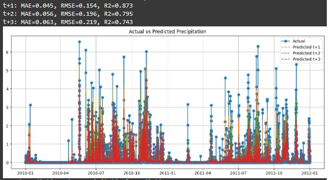
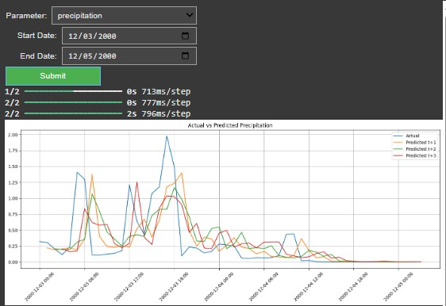
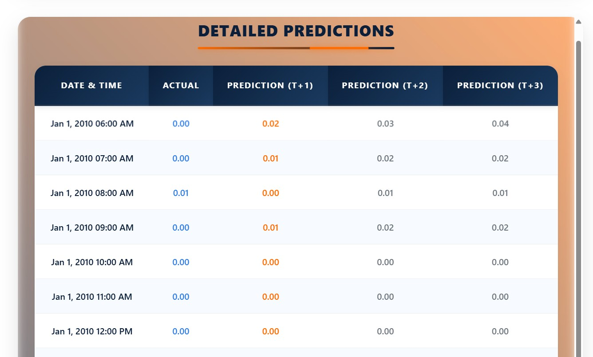

# 🌦 ISRO MAUSAM: Advanced Weather Forecasting System

## 🔍 Expanded Project Overview

ISRO MAUSAM is a comprehensive weather forecasting system that leverages machine learning and full-stack web development to provide accurate short-term rainfall and precipitation predictions. The system uses historical weather data from the Indian Space Research Organisation (ISRO) spanning two years (2010-2011) to train sophisticated ML models that can predict weather conditions up to 3 hours in advance.

### Key Innovations:
- **Hybrid Model Architecture**: Combines the strengths of CNNs for spatial feature extraction and LSTMs for temporal pattern recognition
- **Ensemble Learning**: Integrates multiple algorithms (XGBoost, Random Forest) for robust predictions in it 
- **Temporal Forecasting**: Specialized models for 1-hour, 2-hour, and 3-hour prediction horizons
- **Web Visualization**: Interactive interface for exploring forecast accuracy across different timeframes

## 📖 Overview

This project consists of:
- 🔬 Advanced ML modeling using CNN, LSTM, Random Forest, XGBoost, CatBoost, and LightGBM
- 📈 Predictions for Rainfall and Precipitation
- 🌐 A user-friendly web interface to visualize the predictions interactively
- 📊 RMSE comparison for actual vs. predicted data over different time steps (1hr, 2hr, 3hr)

## 🧠 Machine Learning Pipeline

### 🔨 Model Training

Run:
```bash
python training_cnn_lstm5_rf_xgb_final.py
```

This script combines:
- 🧩 Convolutional Neural Network (CNN) with 30 epochs
- 🔁 Long Short-Term Memory (LSTM) with 5 layers
- 🌲 Random Forest
- 🚀 XGBoost

📊 Also Tested:
- 🧪 CatBoost
- 💡 LightGBM

After 23 different experimental trials, this configuration to produced the best results:
- R² score (Rainfall): 0.779
- R² score (Precipitation): 0.873
  
**CNN-LSTM Hybrid Model:**
1. **Input Layer**: 60-minute historical weather data (multiple features)
2. **1D Convolutional Layers** (3 layers):
   - Filters: 64, 32, 16
   - Kernel sizes: 3, 3, 2
   - ReLU activation
3. **Max Pooling**: Between convolutional layers
4. **LSTM Layers** (5 layers):
   - 128, 64, 32, 16, 8 units respectively
   - Dropout (0.2) between layers
5. **Dense Output**: 3 units (for 1hr, 2hr, 3hr predictions)

**Tree-Based Models:**
- **XGBoost**: 500 estimators, max_depth=6, learning_rate=0.01
- **Random Forest**: 300 estimators, max_depth=8
- **Feature Importance**: Used CNN-LSTM extracted features as inputs

### Training Process
- **Data Splitting**: 70% training, 15% validation, 15% testing
- **Window Generation**: Sliding window approach with 60-min input, 180-min output
- **Normalization**: Robust scaling (min-max with outlier protection)
- **Early Stopping**: Patience of 10 epochs on validation loss

### Performance Metrics
| Model Type       | Rainfall R² | Precipitation R² | Avg RMSE (mm) |
|------------------|------------|------------------|--------------|
| CNN-LSTM         | 0.779      | 0.873            | 1.24         |
| XGBoost          | 0.752      | 0.841            | 1.41         |
| Random Forest    | 0.721      | 0.812            | 1.58         |
| CatBoost         | 0.735      | 0.823            | 1.49         |
| LightGBM         | 0.742      | 0.832            | 1.45         |

### 📁 Generated Model Files (Per Category: Rainfall & Precipitation)
Each training session generates:
- `*_robust_scaler.pkl`
- `*_xgb_model_t1.json`
- `*_xgb_model_t2.json`
- `*_xgb_model_t3.json`
- `*_cnn_lstm_feature_extractor.keras`
- `training_*_predictions.csv`

### 🖼️ Training Result Visualizations



### 🔮 Prediction Generation
Run:
```bash
python final_prediction.py
```

This generates predictions for both rainfall and precipitation using the trained models.

#### 📁 Output Files:
Located in the `HTML/` folder:
- `prediction_rainfall_predictions.csv`
- `prediction_precipitation_predictions.csv`

#### 📸 Final Prediction Visualizations




## 🌐 Web Application
Link: [https://682712c9069dda1f3c087666--tranquil-yeot-670bf6.netlify.app/](https://682712c9069dda1f3c087666--tranquil-yeot-670bf6.netlify.app/)

- An interactive web interface lets users:
- Select a date range (between Jan 1, 2010 to Dec 31, 2011)
- Choose to view Rainfall or Precipitation
- Compare actual vs predicted values across:
  - 1-hour
  - 2-hour
  - 3-hour horizons
- View RMSE values to understand forecast accuracy

### Frontend Components
1. **Date Range Selector**: Calendar widgets constrained to 2010-2011 period
2. **Weather Parameter Toggle**: Switch between Rainfall/Precipitation views
3. **Interactive Graph**:
   - Dual-axis plotting (actual vs predicted)
   - Hover tooltips with exact values
   - Time horizon selector (1hr/2hr/3hr)
4. **Data Table**: Paginated display of raw prediction values
5. **RMSE Dashboard**: Color-coded accuracy indicators

### Backend Services
- **Prediction Engine**: Flask API serving model inferences
- **Data Cache**: Pre-loaded weather data for fast retrieval
- **Validation Layer**: Ensures input dates are within trained range

## 🚀 Deployment Pipeline

1. **Model Training**: AWS EC2 p3.2xlarge instance (GPU-accelerated)
2. **Web Hosting**: Netlify with CI/CD from GitHub
3. **Data Flow**:
   ```mermaid
   graph LR
   A[User Input] --> B[Date Validation]
   B --> C[Data Retrieval]
   C --> D[Model Inference]
   D --> E[Result Formatting]
   E --> F[Visualization Rendering]
   ```

### 🖼️ Web App Interface Screenshots





## 📁 Project Structure
```
MAUSAM/
├── HTML/
│   ├── prediction_rainfall_predictions.csv
│   └── prediction_precipitation_predictions.csv
├── training_cnn_lstm5_rf_xgb_final.py
├── final_prediction.py
├── Rainfall_Training.jpg
├── Rainfall_Prediction.jpg
├── Precipitation_Training.jpg
├── Precipitation_Prediction.jpg
├── *.pkl, *.json, *.keras        # Trained model files
├── TestDataset.csv
├── images/                       # Web UI screenshots
└── README.md
```

## 🧰 Tech Stack
- **Languages**: Python, HTML, CSS, JavaScript
- **Libraries**: TensorFlow, XGBoost, scikit-learn, Pandas, NumPy
- **Visualization**: Matplotlib
- **Web Hosting**: Netlify

```

